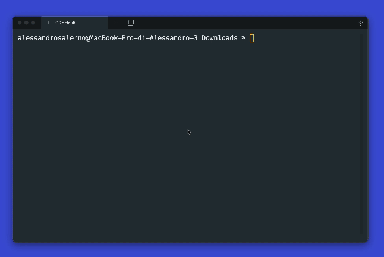

<p align="center">
    <h1 align="center">tarman</h1>
    <p align="center"> The portable, cross-platform, extensible, and simple package manager for tar/tar.gz/tar.xz (and others!) </p>
</p>

<div align="center">

[contributors-shield]: https://img.shields.io/github/contributors/Alessandro-Salerno/tarman.svg?style=flat-square
[contributors-url]: https://github.com/Alessandro-Salerno/tarman/graphs/contributors
[forks-shield]: https://img.shields.io/github/forks/Alessandro-Salerno/tarman.svg?style=flat-square
[forks-url]: https://github.com/Alessandro-Salerno/tarman/network/members
[stars-shield]: https://img.shields.io/github/stars/Alessandro-Salerno/tarman.svg?style=flat-square
[stars-url]: https://github.com/Alessandro-Salerno/tarman/stargazers
[issues-shield]: https://img.shields.io/github/issues/Alessandro-Salerno/tarman.svg?style=flat-square
[issues-url]: https://github.com/Alessandro-Salerno/tarman/issues
[license-shield]: https://img.shields.io/github/license/Alessandro-Salerno/tarman.svg?style=flat-square
[license-url]: https://github.com/Alessandro-Salerno/tarman/blob/master/LICENSE.txt

[![Contributors][contributors-shield]][contributors-url]
[![Forks][forks-shield]][forks-url]
[![Stargazers][stars-shield]][stars-url]
[![Issues][issues-shield]][issues-url]
[![MIT License][license-shield]][license-url]


</div>

<div align="center">
  
</div>

## Why tarman?
Archives are often used in the Linux world to distribute packages that work on all distros, but this often comes with the caveat of having to manually manage the installation and, worst of all, updtes. One notable example is [Discord](https://discord.com/) which only provides packages for Debian-abased distros, while everybody else is left with a `tar.gz` archive which contains a version of the program that can't even update itself.

Some distros try to solve the issue by letting their users create and distribute packages (see [Arch User Repository](https://aur.archlinux.org/)), but obviously this means downloading software from unofficial sources which may break the ToS and can potentially be dangerous.

Tarman solves this by automating the steps you would have to follow to install archives as packages. Much like a regular package manager, it is able to install packages from local files, URLs and repositories.

## How to install tarman
You can install tarman... with tarman...

On Linux:
```sh
curl -L "https://github.com/Alessandro-Salerno/tarman/raw/refs/heads/latest-build/linux/tarman" -o ./tarman && chmod +x ./tarman && ./tarman add-repo "https://github.com/Alessandro-Salerno/tarman-user-repository/raw/refs/heads/latest-repos/linux.tar.gz" && ./tarman install -r tarman && rm ./tarman
```

> [!IMPORTANT]
> To use tarman properly, you'll have to add it to your `PATH` environment variable. This procedure depends on you [Shell](https://en.wikipedia.org/wiki/List_of_command-line_interpreters), with bash for example:
> ```sh
> echo "export PATH=$PATH:~/.tarman/path/" >> ~/.bashrc
> ```

## How to use tarman
This is a CLI tool, so the only way to interact with it (at the moment) is through the Terminal. After installing it, type `tarman help` for a list of commands and options. To install a package you can use the `tarman install` command with the following options:
- `-u` Downlaods from a URL (e.g., `tarman install -u https://some.domain/some/path/archive.tar.gz`)
- `-r` Downloads from a repository using a recipe (e.g., `tarman install -r nvim`)
- `-f` Is often used with `-u` to set the archive format (e.g., `-f zip`)
- If neither `-u` nor `-r` are specified, tarman will assume that you have an archive locally (e.g., `tarman install ~/Downloads/program.tar.gz`)

## Portable?
Archives have the advantage of being universal. The `tar` format, for example, is standardized and documented, thus anyone with the right know-how can create their own program to archive and extract tarballs. Tarman is designed to take advantage of this, its source code is structured in a way that should make it very easy to port to operating systems other than GNU/Linux. In fact, there's a working port for macOS (Darwin)!

Tarman should be fit for Hobby Operating Systems since it leaves most concrete aspects to the OS-specific implementation and avoids the use of advanced OS features (e.g., dynamic linking with `dlopen`).

See the [documentation](docs/porting.md) for more information.

## Extensible?
Tarman has a tiny core and is very modular. There's no code to extract archives or download files in the core program, instead tarman relies on other programs. By default, it attempts to call `tar` and `curl` from the `PATH` environment variable, but plugins can be writte and installed to support other backends and file formats!

See the [documentation](docs/plugins.md) for more information.

## How to build tarman
Using the included Makefile:
```sh
make debug        # Compile the whole program (plugins included) in debug mode
make release      # Compile the whol program (plugins included) in release mode
make plugin-sdk   # Compile ONLY the Plugin SDK
make plugins      # Compile the Pugin SDK and all built-in plugins
```

## License
Tarman is distributed under the GNU General Public License v3.0 or later. This only applies to the core source code (and headers) of the program, files added by contributors may be distributed under different licenses. The license is always stated at the beginning of each source file. The copyright notice at the top of each source file states the name of the original creator of the file, copyright for changes and contributions however belong to their authors. 

The list of authors can be found [here](./AUTHORS)

## Contributing
There's much to be done here, so if you want to contribute, go ahead! Read (and expand) the [documentation](./docs) and the [CONTRIBUTING](./CONTRIBUTING.md) file and take not of the license policy stated above.
